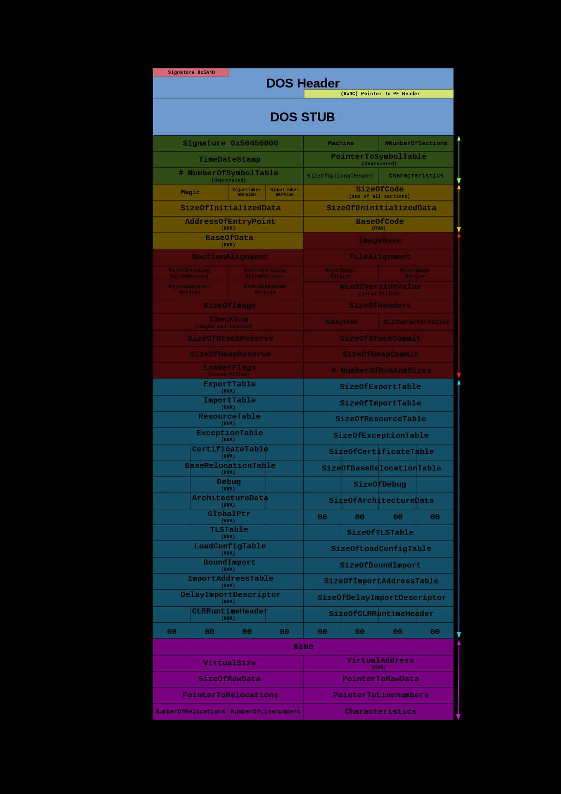
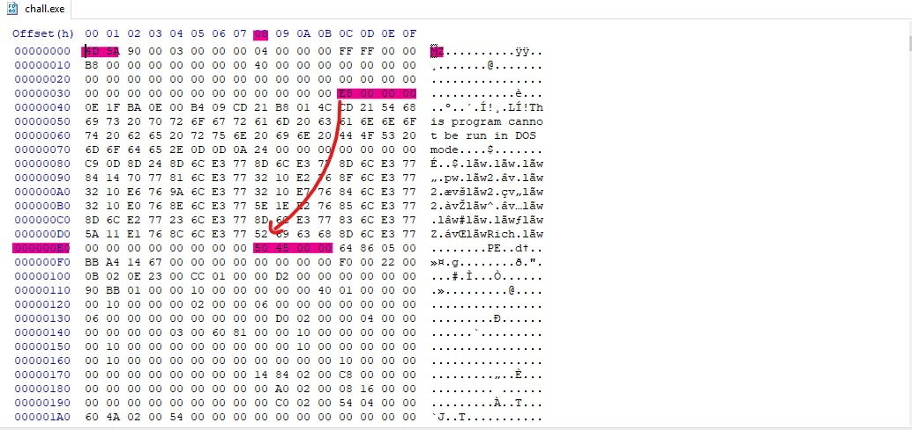
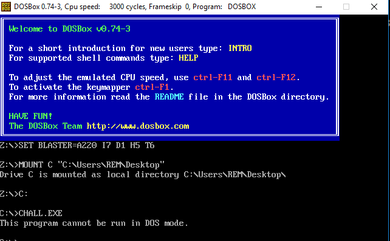
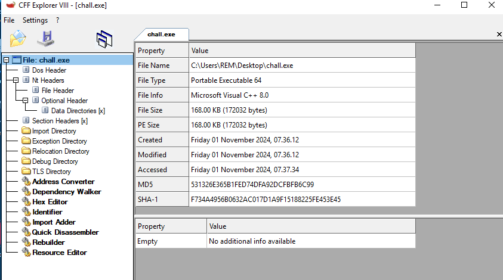
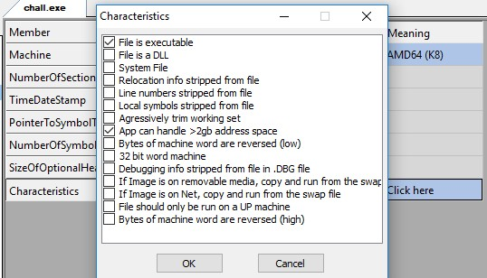
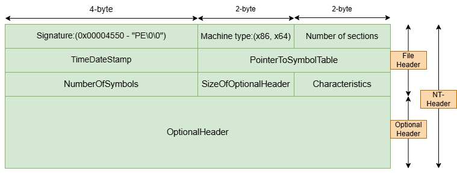
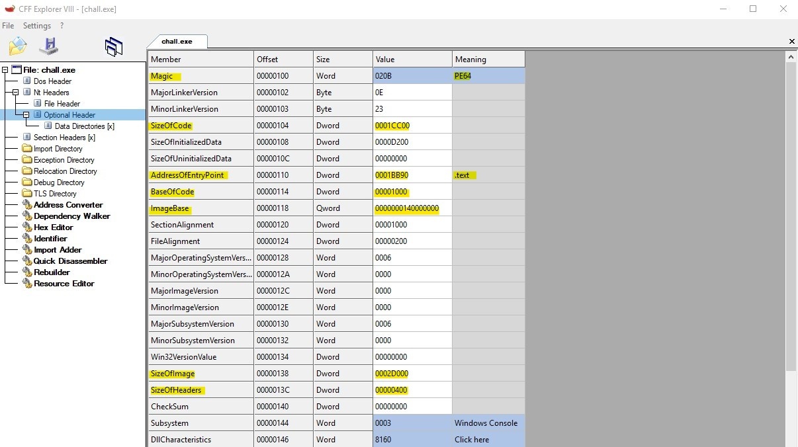
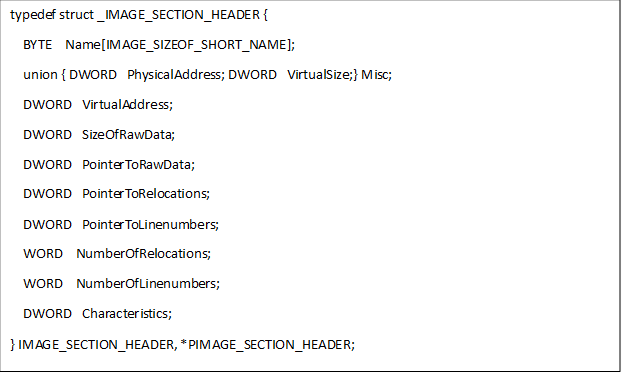
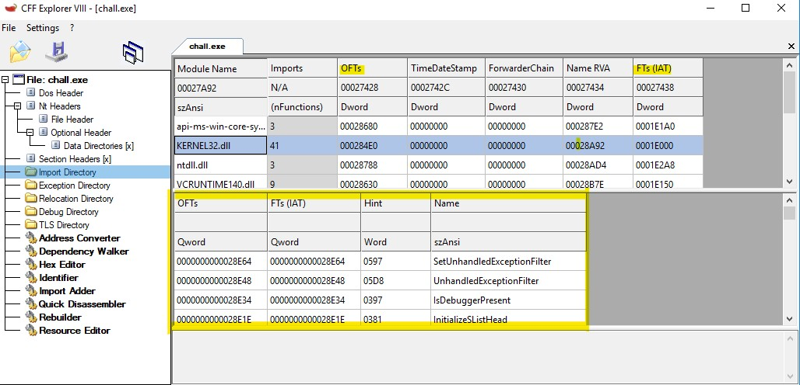

**Outline**

**Introduction**

**History of Evolution**

> **1. COM Format (1970s -- Early 1980s)**
>
> **2. MZ Format (1980s)**
>
> **3. NE Format (Mid-1980s)**
>
> **4. LE and LX Formats (Early 1990s)**
>
> **5. COFF Format (Late 1980s -- Early 1990s)**
>
> **6. PE Format (1993 -- Present)**

**Why PE?**

**PE File Abstract**

> **- DOS Header**
>
> **- DOS Stub**

**NT Headers**

> **- PE Signature**
>
> **- File Header**
>
> **- Optional Header**

**Section Header**

> **- Key Fields**

**Data Directory**

> **- Common Directories**

**Tools for PE File Analysis**

**Detailed Analysis of Headers**

> **- NT Header Structure**
>
> **- Optional Header Values**

**Section Header Explained**

> **1. .text Section**
>
> **2. .rdata Section**
>
> **3. .data Section**
>
> **4. .pdata Section**
>
> **5. .reloc Section**

**Key File Attributes**

**How a PE File Loads in Memory**

> **1. Loading the PE File**
>
> **2. Reading the Headers**
>
> **3. Memory Allocation**
>
> **4. Mapping Sections into Memory**
>
> **5. Relocation (if needed)**
>
> **6. Fixing Up the Imports**
>
> **7. Setting Up the Entry Point**
>
> **8. Running the Program**

**Importance of Understanding PE Loading Process**

**Introduction**

The PE (Portable Executable) file format is the standard for executable
files, DLLs (Dynamic Link Libraries), and system files in the Windows
operating system. Understanding the PE file structure is crucial for
anyone involved in software development, reverse engineering,
cybersecurity, or system administration. This file format allows Windows
to load applications and execute them properly by providing critical
information about how the file should be processed in memory.

When you analyze a PE file, you dive into a carefully structured
blueprint of how a program is organized and executed. From the headers
that guide the operating system to the specific sections where the code
and data reside, the structure of the PE file is key to understanding
its function.

By reading this, you\'ll gain insights into:

-   How PE files are structured: Learn the different sections and
    headers that make up a PE file.

-   Why this structure matters: Discover the role each part of the file
    plays in the execution process.

-   Practical benefits: Understanding the structure helps in debugging,
    security analysis, and reverse engineering, allowing professionals
    to manipulate and optimize PE files effectively.

**1. History of Evolution**
1. COM Format (1970s -- Early 1980s)**

The COM format was one of the earliest and simplest file formats for
executable programs. It came from the days of CP/M and later **MS-DOS**.

-   What it was: Think of it as a raw file with just the program\'s code
    and nothing else. There were no headers or extra information---just
    the instructions that the computer would run.

-   Why it worked: It was simple and efficient for small programs,
    limited to 64 KB in size. Perfect for the early days of computing.

-   Why it fell short: As programs grew bigger and more complex, this
    format struggled. It didn't support features like splitting code and
    data or dynamic linking, and managing memory was a nightmare.

**2. MZ Format (1980s)**

Next came **the MZ** format, named after **Mark Zbikowski**, who worked
at Microsoft. It was the first format used for MS-DOS executables.

-   What changed: The **MZ** format added a small header at the start of
    the file. This header contained information like the program size,
    where to start running the code, and a magic number (\"**MZ**\") to
    identify the file type.

-   Why it was better: Programs could now handle more than 64 KB by
    using segmented memory---dividing the program into sections for
    code, data, and stack.

-   The problem: It was still limited to the DOS world and couldn't
    handle modern features like dynamic linking or relocation.

**3. NE Format (Mid-1980s)**

With the rise of Windows, the NE (New Executable) format appeared. It
was made to support 16-bit Windows applications.

-   The big improvements:

    -   Dynamic linking: Programs could now share code using DLLs
        (Dynamic-Link Libraries).

    -   Relocation: This meant the program could be loaded into
        different memory locations without breaking.

    -   Resources: Developers could include icons, menus, and other UI
        elements directly in the file.

-   Why it didn't last: It was tied to 16-bit systems, which became
    outdated as computing shifted to 32-bit and beyond.

**4. LE and LX Formats (Early 1990s)**

The LE and LX formats were designed for 32-bit applications on advanced
operating systems like OS/2.

-   What made them stand out:

    -   They supported 32-bit architectures, which allowed for much
        larger and more powerful applications.

    -   Demand paging: Only loaded parts of the program into memory as
        needed, saving resources.

    -   Virtual memory: Made multitasking smoother and more efficient.

-   Why they didn't dominate: They were mostly used in niche
    environments like OS/2, which lost the battle to Windows.

**5. COFF Format (Late 1980s -- Early 1990s)**

The **COFF** (Common Object File Format) started on Unix systems and
introduced a more modular way to manage program files.

-   What it brought to the table:

    -   Files were divided into sections, like code, data, and debug
        information.

    -   It made linking programs easier and more reliable.

    -   Included metadata, which made debugging and managing the files
        simpler.

-   Where it struggled: While great for Unix, **COFF** didn't have
    built-in support for Windows-specific features, like embedding
    resources or dynamic linking.

**6. PE Format (1993 -- Present)**

Finally, we get to the PE (Portable Executable) format, which became the
backbone of Windows executables. It's built on COFF but adds so much
more to fit the needs of modern systems.

-   Why it's awesome:

    -   Dynamic linking: Fully supports DLLs, making programs modular
        and efficient.

    -   Section-based structure: Keeps code, data, and resources
        separate for better organization and memory management.

    -   Memory permissions: Each section can have specific permissions
        (like read, write, or execute), adding a layer of security.

    -   Relocation: Programs can be loaded anywhere in memory without
        breaking.

    -   Resources: Developers can include images, icons, and additional
        files right in the executable.

    -   Cross-platform flexibility: Works with multiple architectures
        (like x86, x64, and ARM).

**Why PE ??**

> The **PE** (Portable Executable) format was developed to overcome the limitations of older file formats like MZ, which were insufficient for modern software needs. The PE format enhances organization, efficiency, and security in executable files. Here are the primary reasons it became the standard:

> 1. **Separation of Code and Data**: The PE format distinctly separates program code from data, improving memory management and making it easier to locate various elements within the code.
> 2. **Improved Memory Management**: PE files assign specific memory permissions to different sections, enhancing security and preventing malicious actions. The system uses smaller memory pages (typically 4KB) for efficient resource allocation.
> 3. **Memory Efficiency**: The format conserves space by leaving uninitialized variables unfilled, thus optimizing both memory and loading speed.
> 4. **Support for Dynamic Linking**: PE files can link to external libraries (DLLs), allowing for smaller executables, reduced memory usage, and simplified software updates.
> 5. **Flexibility in Memory Allocation**: The relocatable nature of PE files allows the operating system to load applications at various memory addresses, improving overall memory usage.
> 6. **Embedded Resources**: PE format can incorporate various resources, such as icons and configuration files, directly into the executable, streamlining deployment.
> 7. **Cross-Platform Compatibility**: PE format is portable across multiple processors and platforms, including Windows environments.

Not only .exe files are PE files, dynamic link libraries (.dll), Kernel
modules (.srv), Control panel applications (.cpl) and many others are
also PE files.

PE File Abstract :

{width="3.740972222222222in"
height="7.693251312335958in"}

> A PE file is a data structure that holds information necessary for the
> OS loader to be able to load that executable into memory and execute
> it.
>
> I will use any hex-editor to explain in abstract pe structure then we
> will dive deep into pe file
>
> **In the first** **DOS Header:**
>
> The DOS header is located at the start of the PE file with a
> 64-bytes-long structure and always begins with the ASCII characters
> "MZ" (0x4D, 0x5A). This is known as the Magic Number, which identifies
> the file as an MS-DOS executable
>
> The DOS header structure includes the following:
>
> {width="6.495138888888889in"
> height="3.0694444444444446in"}
>
> **1. Magic Number (0x4D, 0x5A)**
>
> O . The first two bytes represent \"MZ,\" identifying the file as an
> MS-DOS executable.
>
> **2. File Address of the PE Header (Offset 0x3C)**
>
> O . This field points to the location of the PE header, allowing the
> Windows operating system to locate it in the file which in our case is
> 000000E8.
>
> The DOS header is followed by the **DOS_STUB**, a small program that
> typically displays an error message or instructions when the file is
> run on an unsupported system
>
> **DOS Stub:**
>
> After the DOS header comes the DOS stub which is a small MS-DOS 2.0
> compatible executable that just prints an error message saying "This
> program cannot be run in DOS mode" when the program is run in DOS
> mode.
>
> {width="6.495138888888889in"
> height="3.0694444444444446in"}
>
> Size: Usually 60-70 bytes, but can vary depending on the
> implementation.
>
> Code: The executable code that is run when a PE file is executed in a
> DOS environment. This code typically displays a message.
>
> Message: Commonly includes text such as: This program cannot be run in
> DOS mode
>
> to see the benefit of the previous section we will run it at dos mode
> to see the massege
>
> {width="6.495138888888889in"
> height="4.059406167979002in"}
>
> **NT Headers:**
>
> It is difficult to see these headers in a hex editor, so we will cover
> them in detail later using tools to make it easier.
>
> The NT Headers part contains three main parts:
>
> **PE signature:** A 4-byte signature that identifies the file as a PE
> file.
>
> **File Header:** A standard COFF File Header. It holds some
> information about the PE file.
>
> **Optional Header:** The most important header of the NT Headers, its
> name is the Optional Header because some files like object files don't
> have it, however it's required for image files (files like .exe
> files). This header provides important information to the OS loader.
>
> **Section Header:**
>
> in a PE file contains important metadata about each section of the
> executable
>
> **Key Fields:**

1.  **Name:** The name of the section (e.g., .text, .data).

2.  **Virtual Size:** The actual size of the section in memory.

3.  **Virtual Address:** The memory address where the section will be
    > loaded.

4.  **Size of Raw Data:** The size of the section data in the file.

5.  **Pointer to Raw Data:** The offset in the file where the section
    > starts.

6.  **Characteristics:** Flags defining section properties (e.g.,
    > executable, readable, writable).

> **Data Directorie:**
>
> To point to important data structures, such as imports, exports, or
> debugging information, used during program execution.
>
> **Common Directories:**

1.  **Export Table:** Details exported functions and data.

2.  **Import Table:** Contains information about imported libraries and
    > functions.

3.  **Resource Table:** Stores resources like icons, strings, and
    > bitmaps.

4.  **Exception Table:** Holds information about exception handling.

5.  **Certificate Table:** Contains security certificates for digital
    > signing.

6.  **Relocation Table:** Used for address adjustments during loading.

7.  **Debug Directory:** Contains debugging information.

8.  **TLS (Thread Local Storage) Table:** Holds data used for
    > thread-specific storage.

> We will cover every part in details later
>
> Now we will talk about tools that will help us to deep dive into PE
> file and understand the structure of PE file

**Pe file analysis tool :**

**CFF Explorer:** We will use CFF Explorer. It is a good tool to analyze
PE file headers, and it provides a good GUI, which makes the process
very easy. You can download it from this
\"https://ntcore.com/files/CFF_Explorer.zip\" and install it like any
other program.

After installing it and running it, you will find the empty GUI looks
like this :

{width="6.495833333333334in"
height="4.313194444444444in"}

When you drag the file you want to analyze and drop it, you will find
this:

{width="6.5in"
height="3.6243055555555554in"}

As you can see, there are a lot of things you already know, as we
explained in previous sections. Other parts will be explained later

So, we will explain the important values in each header. Now, we will
explain the **DOS header:** As mentioned before, it's a 64-byte-long
structure, we can take a look at the contents of that structure by
looking at the IMAGE_DOS_HEADER structure definition from winnt.h:

{width="4.488888888888889in"
height="3.9680555555555554in"}

But we can found the important values as showen in next image:

{width="6.495833333333334in"
height="1.6868055555555554in"}{width="6.495833333333334in"
height="0.29583333333333334in"}

-   **e_magic:** This is the first member of the DOS Header, it's a WORD
    so it occupies 2 bytes, it's usually called the magic number. It has
    a fixed value of 0x5A4D or MZ in ASCII, and it serves as a signature
    that marks the file as an MS-DOS executable.

-   **e_lfanew:** This is the last member of the DOS header structure,
    it's located at offset 0x3C into the DOS header and it holds an
    offset to the start of the NT headers. This member is important to
    the PE loader on Windows systems because it tells the loader where
    to look for the file header.

**Essential Base:**

Before we dive into the main content, it\'s essential to discuss a key
concept that will be frequently referenced: the Relative Virtual Address
(RVA). An RVA represents an offset from the memory location where the
image is loaded, known as the Image Base. To convert an RVA into an
absolute virtual address, you simply add the RVA value to the Image Base
value. We\'ll see how crucial RVAs are in the context of PE files as we
continue.

**RVA** stands for **Relative Virtual Address**.

It's a way to describe the location of something (like code, data, or
resources) within the program\'s memory. Unlike an absolute address,
which points to a specific physical or virtual location in memory, an
RVA is a relative offset from the start of the program's **Image
Base** (the preferred starting address where the program is loaded in
memory).

**Breaking It Down:**

1.  **Image Base**:

    -   The base address where the program is loaded into memory.

    -   Example: Let's say the Image Base is 0x400000.

2.  **RVA**:

    -   It's the offset from the Image Base.

    -   Example: If an RVA is 0x1000, it means the actual memory address
        is Image Base + RVA → 0x400000 + 0x1000 = 0x401000.

  -----------------------------------------------------------------------
  Section         
  Attribute       
  --------------- -------------------------------------------------------
  RVA             Offset from image base

  VA              ( \\text{VA} = \\text{Image Base} + \\text{RVA} )

  Real Size       Size of Raw Data (from section header)

  Virtual Size    Size in memory (from section header)

  Start of        Directly from Virtual Address in section header
  Section (VA)    

  End of Section  ( \\text{End VA} = \\text{Start VA} + \\text{Virtual
  (VA)            Size} )
  -----------------------------------------------------------------------

Example Calculation

Suppose a section has:

> Image Base: 0x400000
>
> RVA: 0x1000
>
> Virtual Size: 0x2000
>
> Calculating VA:
>
> \[\\text{VA} = 0x400000 + 0x1000 = 0x4001000\]
>
> Calculating End VA:
>
> \[\\text{End VA} = 0x4001000 + 0x2000 = 0x4003000\]

**Summarize:**

Relative Virtual Address (RVA): This is the offset from the base of the
image in memory. It indicates where a section or data starts within the
loaded image.

Virtual Address (VA): This is the actual address where the section will
be loaded into memory. It can be calculated by adding the image base to
the RVA.

Real Size: This refers to the actual size of the section on disk (the
file size) versus the size of the section in memory (the memory size,
which is typically aligned).

**Nt Header:**

The NT headers are defined in the \`winnt.h\` file as the
\`IMAGE_NT_HEADERS\` structure. By examining its definition, we can
identify three primary members: a DWORD signature, an
\`IMAGE_FILE_HEADER\` structure called \`FileHeader\`, and an
\`IMAGE_OPTIONAL_HEADER\` structure referred to as \`OptionalHeader\`.

It\'s important to note that this structure is defined in two versions:
one for 32-bit executables (commonly referred to as PE32 executables)
known as \`IMAGE_NT_HEADERS\`, and another for 64-bit executables
(referred to as PE32+ executables) called \`IMAGE_NT_HEADERS64\`. The
key distinction between these two versions lies in the corresponding
\`IMAGE_OPTIONAL_HEADER\` structure, which also has two versions:
\`IMAGE_OPTIONAL_HEADER32\` for 32-bit executables and
\`IMAGE_OPTIONAL_HEADER64\` for 64-bit executables.

**PE Signature:** The PE Signature is a critical component of the NT
Header in a PE (Portable Executable) file format. It marks the start of
the NT Header and is used to identify the file as a valid PE file:

{width="6.4936668853893265in"
height="2.913043525809274in"}

**File Header** : is part of the NT Header in a PE file and provides
essential metadata about the executable It's defined as
IMAGE_FILE_HEADER in winnt.h, here's the definition:

{width="6.495833333333334in"
height="3.834722222222222in"}

As you can see, it contains some information. We will explain each one
of them.

1.  **Machine(2-byte):**

    -   Identifies the type of CPU the file is intended for.

    -   Examples:

        -   0x014C: 32-bit (x86).

        -   0x8664: 64-bit (x64).

        -   0x0200: Intel Itanium.

> You can find more values is this page
> https://learn.microsoft.com/en-us/windows/win32/debug/pe-format

2.  **NumberOfSections(2-byte):**

    -   Indicates the number of sections defined in the Section Table.
        Each section represents a part of the file, such as .text (code)
        or .data (data).

    -   **Maximum number of sections**: **65535** (limited by the
        **2-byte field** in the File Header).

    -   **Practical number of sections**: Typically between **1 to 20**
        sections in most PE files.

3.  **TimeDateStamp:**

    -   Helps determine when the file was compiled or last modified.
        Tools often use this to track versions or debugging purposes.

4.  **PointerToSymbolTable:**

> **Symbol Table** : In older formats like COFF (Common Object File
> Format), the symbol table was used to store information about the
> symbols (such as functions, variables, and other program identifiers)
> within the executable. The symbol table allowed linkers and debuggers
> to map names to memory addresses and perform linking and debugging
> tasks. For modern Windows executables, symbol resolution is typically
> handled using PDB files, and the PointerToSymbolTable in the File
> Header is often set to 0.

5.  **SizeOfOptionalHeader:**

    -   Indicates the size of the Optional Header.

    -   The Optional Header contains information like entry points, base
        addresses, and image sizes.

6.  **Characteristics:**

    -   A bitfield defining the attributes of the file.

    -   You can see a button labeled \"Click Here.\" When you press this
        button, it will convert the hex values to reveal what they refer
        to
        {width="5.6in"
        height="3.2090277777777776in"}

    -   Common values:

        -   0x0002: Executable file.

        -   0x0100: 32-bit application.

        -   0x2000: DLL file

{width="6.497916666666667in"
height="2.484027777777778in"}

**Optional Header:** It\'s essential for the operating system to know
how to handle the program. Think of it as a guidebook for the OS. We
will explain the important values in it

Let's take a look at the definition of both structures.

{width="6.5in"
height="3.7043482064741906in"}

{width="6.495833333333334in"
height="1.0784722222222223in"}

**1. Magic**

The **Magic** value is like a label that tells the system if the program
is for a 32-bit or a 64-bit computer.

-   If it says **PE32**, it's a 32-bit program. \"0x10B\"

-   If it says **PE32+**, it's a 64-bit program. \"0x20B\"

-   Identifies the image as a ROM image. \"0x107\"

It's the first step for the operating system to know how to handle the
program.

**2. Size of Code**

This value is the total size of all the program\'s instructions (the
code that actually runs).\
Think of it as the size of the \"action plan\" for the program. The OS
needs this number to load all the instructions into memory correctly.

**3. Address of Entry Point**

This is the starting point of the program---the first instruction the
system will execute when the program runs.

-   For an executable, it's where the program begins.

-   For a DLL, it's where the initialization happens.

If this address is wrong, the program won't work because it won't know
where to start.

**4. Image Base**

The **Image Base** is like the program's "home address" in memory.

-   The program tells the OS, "I'd prefer to live at this address."

-   If no other program is using that address, the OS will load it
    there. If the address is taken, the OS will move it somewhere else
    (and fix any references internally).

**5. Base of Code**

This tells the system where the actual program instructions (code) begin
within the program\'s memory layout.\
Think of it as a bookmark that says, "Start reading the instructions
from here."

**6. Size of Headers**

The headers contain all the information about the program (like a table
of contents). This value tells the OS how big that table of contents is
so it knows where the actual program data starts.

**7. Size of Image**

This is the total space the program will take up in memory, including
the headers and all sections (code, data, etc.).\
It's like saying, "I need this much space in memory to work properly."

**Data Directory:** in the NT Header is like an index pointing to
special features or resources that the program might use. Think of it as
a list of important addresses or locations where the operating system
can find extra information or functionality the program needs.

Here's how it works:

The Data Directory doesn't store the actual data itself. Instead, it
tells the operating system, "Hey, if you're looking for this specific
thing, here's where you can find it in the program's memory layout."

As you can see in the next image that every one of directorys has RVA
and Size Size is the real size at the desk we found the structure of it
like this:

IMAGE_NUMBEROF_DIRECTORY_ENTRIES is a constant defined with the value
16, meaning that this array can have up to 16 :

An IMAGE_DATA_DIRETORY structure is defines as follows:

It's a very simple structure with only two members, first one being an
RVA pointing to the start of the Data Directory and the second one being
the size of the Data DirectoryIMAGE_DATA_DIRECTORY
entries:{width="6.495833333333334in"
height="6.695833333333334in"}

Before we dive deep into the section header, we need to explain where
each directory is located.

As you can see, there are multiple columns containing values. These
values provide information about the location of each directory

We have already explained the RVA and the Raw Size (real size). Now, we
are going to explain the sections, but we will focus on the section
columns that indicate where each directory is located.

We also found that every directory has two rows---one for the RVA and
another for the size. The first row explains the location of the RVA of
the directory. I will provide a graph that explains this.

We will take the import directory example so we can find that offset of
rva is 0x178 when we going to this offset at any hexeditor :

{width="6.253778433945757in"
height="0.6818186789151356in"}

Now we can find the value of the RVA 0x28414, which, when calculated,
gives us the starting address of the import directory. Additionally, we
can see the size of the directory. We have also found that the offset
0x178 is a pointer to the starting address of the import directory, and
the offset 0x17C holds the value of its size.

Now we will explain the easiest and most important header, which is the
**Section Header**. Section Header is a structure named
IMAGE_SECTION_HEADER defined in winnt.h as follows:

{width="6.521527777777778in"
height="3.8965277777777776in"}

Each section in a PE file, like .text (code), .data (data), and others,
is described by such a header. Let's break down the fields:

**Field-by-Field Explanation:**

1.  **DWORD VirtualAddress**:

    -   Represents the **relative virtual address (RVA)** of the
        section.

    -   This is the address in memory where the section will be loaded,
        relative to the base address of the image.

2.  **DWORD SizeOfRawData**:

    -   Indicates the **size of the section\'s data** in the file.

    -   This is the actual size of the data stored in the PE file on
        disk. It might be padded to align with a section alignment
        boundary.

3.  **DWORD PointerToRawData**:

    -   Points to the **starting location of the section\'s data** in
        the PE file.

    -   This offset tells where to find the section\'s raw data on disk.

4.  **DWORD PointerToRelocations**:

    -   Offset to the section\'s **relocation entries** within the file
        (if applicable).

    -   Relocations are used for adjusting addresses when the module is
        loaded at a different base address. Generally, this field is 0
        for executable images, as relocations are not stored in the
        section headers.

5.  **DWORD PointerToLinenumbers**:

    -   Offset to **line-number information** for debugging.

    -   In modern PE files, this field is often 0, as line numbers are
        typically stored in debug information rather than in the section
        headers.

6.  **WORD NumberOfRelocations**:

    -   Number of **relocation entries** for the section.

    -   This is only relevant if the section contains relocations (e.g.,
        for object files). For executables, this is often 0.

7.  **WORD NumberOfLinenumbers**:

    -   Number of **line-number entries**.

    -   Again, this is mostly 0 for modern PE files and is relevant
        primarily for debugging.

8.  **DWORD Characteristics**:

    -   Flags describing the **characteristics of the section**.

    -   This field contains a combination of bit flags indicating
        properties like whether the section is executable, writable,
        readable, etc. Examples:

        -   0x20000000: Contains executable code.

        -   0x40000000: Contains initialized data.

        -   0x80000000: Contains uninitialized data.

I will take a screenshot of this header from CFF Explorer, then I will
explain it using PE Studio.

{width="6.495833333333334in"
height="1.5909722222222222in"}

Now, we will take a look at this header in PE Studio and explain each
field in detail.

{width="6.495833333333334in"
height="2.095833333333333in"}

As you can see there is 5 sections as we knowen before, we will explain
it and claculate how can we know where it is starting and where the
endinf of it

**1. .text Section: The Brain Department**

This is the most important department---it holds the actual instructions
the program needs to follow. Think of it as the brain of the building
where all decisions are made. It's protected so that nobody can mess
with it because changing these instructions would break the entire
program.

**2. .rdata Section: The Archive Room**

This section is like a locked archive where the program stores permanent
information it needs to refer to but doesn't want to change. Things like
phone directories (constants) or fixed rules (strings) are kept here. It
also includes some important files that tell the program how to talk to
other buildings (libraries or DLLs).

**3. .data Section: The Workspace**

Here's the messy but essential workspace of the program. Employees (the
program) use this area to keep notes, track numbers, or update variables
that change during the day. Unlike the archive, this space is flexible
and designed for day-to-day work.

**4. .pdata Section: The Emergency Handbook**

This department is the safety officer of the building. If something goes
wrong---like an unexpected error or fire alarm---it knows exactly what
to do. It contains the program's emergency response plan, so it can
handle crashes or exceptions without falling apart.

**5. .reloc Section: The Moving Crew**

This is the team that comes in when the office building can't be set up
in its usual spot. If another program is already using its preferred
location in memory, this team helps it move everything to a new spot and
still work perfectly. It's all about flexibility and avoiding conflicts.

After we have seen the meaning of each section, we now need to explain
the meaning of each value in the previous image.

**MD5 Value**

> Think of the MD5 value like a fingerprint for the file. It\'s a unique
> string of numbers and letters that identifies the file. Just like
> every person has a unique fingerprint, every file has a unique MD5
> hash. If the file changes even a little, the MD5 value will change
> too. It\'s a quick way to check if the file has been tampered with or
> altered.

**File-Ratio**

> This is the comparison between the file size when it's in memory and
> the file size when it's stored on disk. If the file gets compressed or
> changes in any way during execution, the file-ratio tells us how much
> it's being altered as it runs.

**Virtual Size**

> Imagine you're looking at a map of a city. The virtual size tells us
> the total amount of memory the program needs when it's running, like
> how much space the city (the program) needs on the map. It tells us
> how much \"virtual\" memory the program will take up in the system
> when it's loaded.

**Virtual Address**

> This is the starting address of where the program\'s code or data will
> live in memory. It\'s like giving the program a specific spot on a
> street where it can set up its office (its space in RAM). It's not the
> actual memory location, but rather a logical address that the system
> uses to find it.

**Raw Size**

> This is the actual size of the file as it exists on disk, before it's
> loaded into memory. It\'s like the file in its \"storage\" form. It
> doesn't take into account any adjustments or padding done when the
> file is running, just the raw amount of space it takes up.

**Raw Address**

> Think of this as the \"starting point\" where the file begins on disk.
> It's like the starting point of a road trip---it tells the system
> where to begin looking for the file in its physical location on the
> hard drive.

**Cave**

> A \"cave\" refers to hidden or unused areas in a file. It's like an
> empty room in a house that the file doesn't use, but it's there and
> available. Hackers might sometimes use these caves to hide malicious
> code or other secrets without it being noticed.

**Entropy**

> Entropy is a fancy way of saying \"how random is this file?\" If a
> file has high entropy, it's very unpredictable and hard to compress or
> analyze, like trying to read a scrambled message. Low entropy means
> the file is more organized and predictable, kind of like reading a
> well-structured document.

**Entry Point**

> This is where the program begins its execution. It's like the starting
> line in a race---the point where the operating system hands control to
> the program and tells it, \"Go!\" It marks the first instruction the
> program will run when it starts.

Now, we will dive deeper into the directories found in our example and
explain them in detail.

**Import Directory:**

We have been know the benfits from this directory but not in details so
we will go further to see what is it. The **Import Directory** in a PE
file is basically a list of all the functions a program needs from other
DLLs to work properly. and it is a Data Directory located at the
beginning of the .idata section.Think of it as a \"shopping list\" for
the program, telling Windows:

1.  **Which DLLs to load** (like kernel32.dll or user32.dll).

2.  **Which functions from those DLLs it needs** (like CreateFileA or
    MessageBoxA).

When you run the program, Windows looks at this list, loads the required
DLLs, and connects the program to those functions, so it can use them
during execution.

It's like calling a friend for help and telling them:

-   **Which friend to call** (the DLL).

-   **What help you need** (the function name).

The image of IMAGE_IMPORT_DESCRIPTOR is defined as follows: each one of
them is for a DLL.

It doesn't have a fixed size, so the last IMAGE_IMPORT_DESCRIPTOR of the
array is zeroed-out (NULL-Padded) to indicate the end of the Import
Directory Table.

**1. DUMMYUNIONNAME:**

This is a **union**, meaning it can store **either** Characteristics or
OriginalFirstThunk, but not both at the same time.

-   **Characteristics**: A reserved field, rarely used.

-   **OriginalFirstThunk**: A pointer to the **OFT** (Original First
    Thunk), which is a list of all the functions the program wants from
    the DLL.\
    Think of it as the \"shopping list\" for the program.

**2. TimeDateStamp:**

This field is for **timestamping or binding information**, but most of
the time, it's set to 0.\
If you think of the PE as a logbook, this might tell when the imports
were last updated---but only if it's used.

**3. ForwarderChain:**

This is used if a function is **forwarded** to another DLL. (For
example, one DLL might say, \"I don't have this function, but
someother.dll does.\")\
If there's no forwarding, this value is typically 0.

**4. Name:**

This is a **pointer to the name of the DLL** the program is importing
from. For example, it might point to the string \"user32.dll\".

**5. FirstThunk:**

This is a pointer to the **FT** (First Thunk), which is the actual table
of function pointers. After Windows resolves all the imports, this table
will contain the **real memory addresses of the functions** from the
DLL.

**6. PIMAGE_IMPORT_DESCRIPTOR:**

This is just a **pointer to the structure**. Adding P in front of a name
is a common C-style way of saying, \"This is a pointer to this type.\"

Imagine you're managing a \"help list\" for a program that says:

-   \"I need some help from **user32.dll**.\"

-   \"Here's the list of functions I need (OFT).\"

-   \"Once you load the DLL, please write down the actual addresses for
    these functions so I can call them directly (FT).\"

We need to explain some definitions to understand how the import table
works.

As you can see in this screen, it shows which DLL is being called and
also specifies the functions being referenced.

{width="6.497222222222222in"
height="2.2543350831146105in"}

\--We can now find the **import columns**, which show the number of
imports being called from the module

**Import Lookup Table (ILT)**

Sometimes, the **Import Lookup Table (ILT)** is also referred to as the
**Import Name Table (INT)**.

Each **imported DLL** has its own ILT, and the
**IMAGE_IMPORT_DESCRIPTOR.OriginalFirstThunk** holds the **Relative
Virtual Address (RVA)** pointing to the ILT for the corresponding DLL.

The ILT is essentially a list that helps the loader identify which
functions need to be imported from the DLL. It contains either the
**name** or **ordinal** of each function.

**ILT Structure:**

-   The ILT consists of an array of **32-bit numbers** (for PE32) or
    **64-bit numbers** (for PE32+). The last entry in the array is
    always **zeroed-out** to indicate the end of the ILT.

**Each entry in the ILT encodes the following:**

1.  **Most Significant Bit (Bit 31/63)**:\
    This bit is called the **Ordinal/Name flag**. It tells whether the
    function is being imported by **name** or by **ordinal**.

    -   If the flag is **1**, the function is imported by **ordinal** (a
        unique number).

    -   If the flag is **0**, the function is imported by **name**.

2.  **Bits 15-0 (for PE32) or Bits 15-0 and 62-15 (for PE32+)**:

    -   If the **Ordinal/Name flag** is **1**, these bits hold the
        **16-bit ordinal number** for the function to be imported. The
        rest of the bits (30-15/62-15) are set to **0**.

3.  **Bits 30-0**:

    -   If the **Ordinal/Name flag** is **0**, these bits contain the
        **RVA of the Hint/Name table**.

**Hint/Name Table:**

The **Hint/Name table** is a structure defined in **winnt.h** as
IMAGE_IMPORT_BY_NAME. It contains the **name** of the function along
with a **hint** (a short identifier to speed up name lookup).

**Hint**: A number used to look up a function. It's first used as an
index in the export name pointer table, and if that fails, a binary
search is performed on the table.

**Name**: A null-terminated string containing the function's name to
import.

**Relocation Directory:**

We have explained this part in the Essential Base section, which
explains how to calculate memory mapping and how the system loads the
sections and other parts to their specific locations. But how does the
system know the RVA for every section? This is where the Relocation
Directory comes in. It functions like a table that contains the RVA
locations for each part, and the system calculates these by adding the
RVA to the base of the code. To summarize, it's divided into blocks,
each block representing the base relocations for a 4KB page. Each block
must start on a 32-bit boundary. Each block starts with an
IMAGE_BASE_RELOCATION structure, followed by any number of offset field
entries. The IMAGE_BASE_RELOCATION structure specifies the page RVA and
the size of the relocation block.
